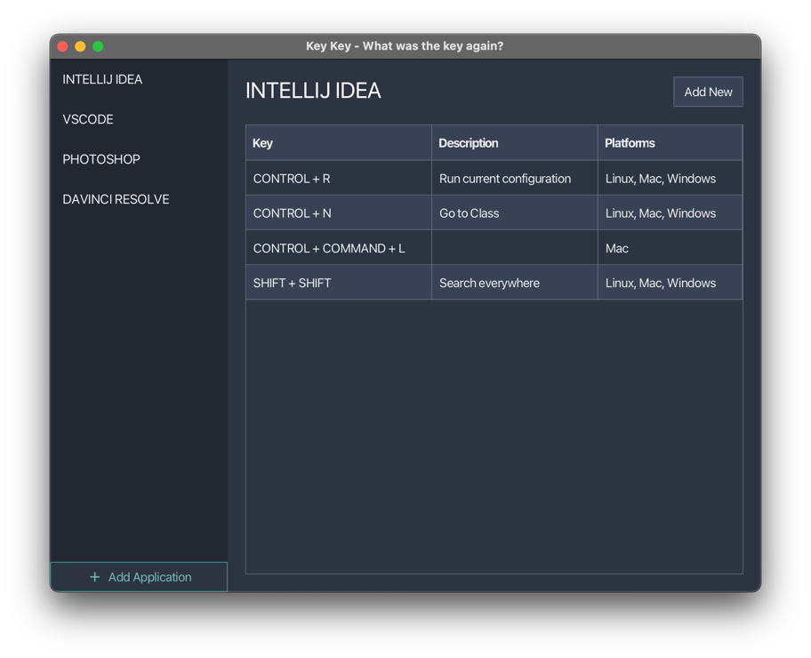

# KeyKey - What was the key again?

KeyKey is a desktop application that helps you remember keyboard shortcuts for your favorite applications.

## Features
*   Add and manage keyboard shortcuts for multiple applications.
*   A clean, modern and simple to use user interface with a dark theme.
*   Data is stored locally in a JSON file.

## Technology Stack
*   Java
*   JavaFX
*   Maven
*   AtlantaFX
*   Ikonli
*   Gson

## How to Run

1.  Clone the repository: `git clone https://github.com/your-username/keykey.git`
2.  Navigate to the project directory: `cd keykey`
3.  Run the application using Maven: `mvn clean javafx:run`

## How to Contribute

Contributions are welcome! Please feel free to submit a pull request or open an issue.

## License

This project is licensed under the MIT License.
